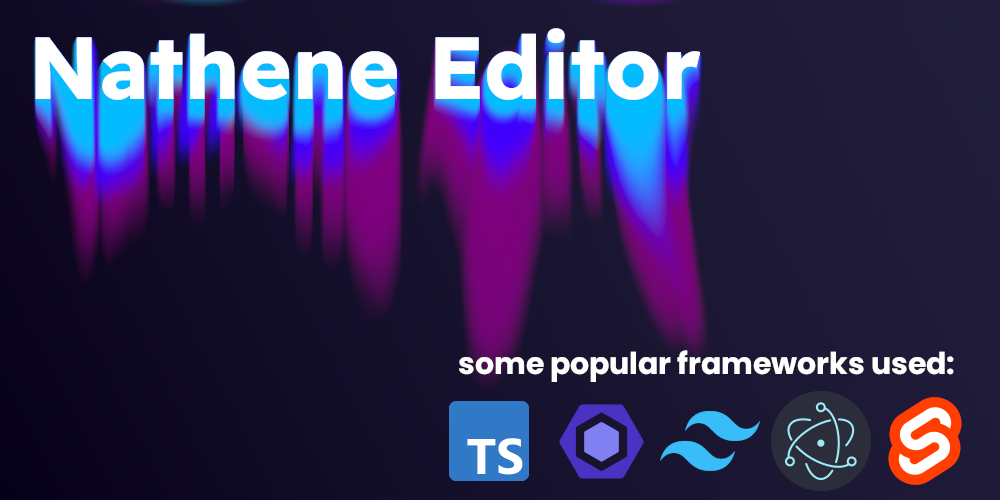

# Nathene Editor | NE

---

## name origin

- **N-** for Nyx:
  - dark theme
  - goddess of the night -> [Nyx in greek mythology](https://en.wikipedia.org/wiki/Nyx)
- **-athene** for Athena:
  - goddess of the wisdom, intelligence -> [Athena in greek mythology](https://en.wikipedia.org/wiki/Athena)
  - Athene is the german name of Athena -> [LuvbCa](https://github.com/LuvbCa) is german
- **Editor**: because its only a editor right now
  - implementation of Plugins in work

---

## Installation instructions

### Developing setup

> ⚠️: Only **developing** environment, no building environment set-up

- Step 1 - Installation of **dependencies**:

  - run `pnpm install` in top level directory

- Step 2 - **Electron**-backend:

  - run `npm start` in `./electron`
  - _optionally: run `tsc --watch -p ./tsconfig.json` in `./electron` for automatic compilation of typescript_

- Step 3 - **Svelte**-frontend:

  - run `npm run dev` in `./svelte`

---

### Building setup

> **🚧UNDER CONSTRUCTION🚧**
